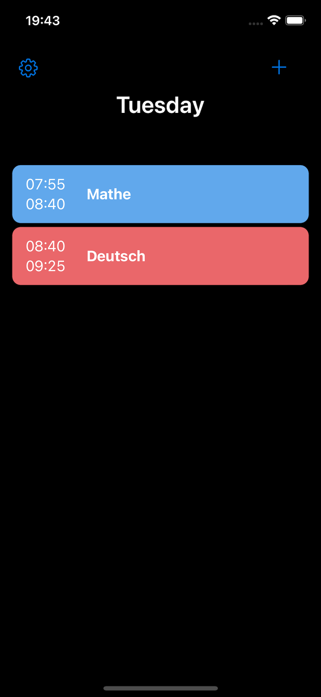

# Timetable iOS App

  
*The Timetable iOS App - Simple, Elegant, and Efficient*

## Overview

The Timetable iOS App is a minimalistic and highly functional timetable application designed for simplicity and ease of use. Perfect for students, professionals, and anyone who needs to manage their schedules efficiently.

## Features

- **Minimalistic Design**: Focuses on essential features without unnecessary clutter.
- **Free and Open Source**: Available for anyone to use, modify, and contribute to.
- **Intuitive User Experience**: Easy to navigate and use, even for first-time users.

## Getting Started
